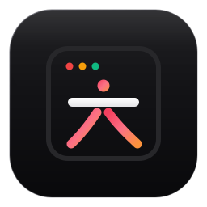

<div align="center">



# natural-chinese-ui

<p>
  <strong>让 AI 用简单务实的中文写软件命名、网页标题和界面文案。</strong><br>
  去掉假大空后缀、硬凑对联与戏精微文案。
</p>

<p>
  <a href="https://skills.sh"></a>
  <a href="./LICENSE"></a>
  <a href="https://github.com/QingYunA/natural-chinese-ui/stargazers"></a>
  
</p>

<p>
  <a href="#-安装使用">安装使用</a> ·
  <a href="#-为什么做这个">为什么做这个</a> ·
  <a href="#-常见对照">常见对照</a> ·
  <a href="#-核心规则">核心规则</a> ·
  <a href="#-词汇对照">词汇对照</a> ·
  <a href="#-自检清单">自检清单</a>
</p>

</div>

---

## 📦 安装使用

推荐直接通过 `skills` 安装到你的编程 Agent（支持 Claude Code, Cursor, Codex 等）：

```bash
# 安装到当前项目
npx skills add QingYunA/natural-chinese-ui

# 全局安装
npx skills add QingYunA/natural-chinese-ui -g
```

<details>
<summary><strong>其他工具接入方式（Cursor / Windsurf / 网页端）</strong></summary>

### 1. Cursor / Windsurf
把仓库中的 [`rules/natural-chinese-ui.mdc`](./rules/natural-chinese-ui.mdc) 拷贝到你的项目 `.cursor/rules/` 目录下即可。

### 2. ChatGPT / Claude 网页端
直接把 [`prompts/system-prompt.md`](./prompts/system-prompt.md) 的纯文本内容复制进自定义指令（Custom Instructions）或系统提示词。

### 3. Antigravity / Google Agentic IDE
在项目根目录运行：
```bash
mkdir -p .agents/skills/natural-chinese-ui
curl -sSL https://raw.githubusercontent.com/QingYunA/natural-chinese-ui/main/SKILL.md -o .agents/skills/natural-chinese-ui/SKILL.md
```

</details>

---

## 💡 为什么做这个

让 AI 写前端页面或小工具时，它经常会用一些很别扭的中文：

- **喜欢加虚词**：把五子棋叫“人机博弈工坊”，把文本加空格叫“排版疏朗矩阵”。
- **喜欢凑对联**：比如“水墨诗笺与活字排版”。
- **喜欢演戏**：把“换一个”写成“随机赋诗”，把“开始”写成“开启博弈之旅”，把报错写成“星球迷路了”。

这样起名别人看不懂，在搜索引擎上也搜不到。

这个规范的目的很简单：让 AI 按照正常人的习惯写文案，是什么就叫什么。

---

## ⚡ 常见对照

| 场景 | AI 常见写法（避免） | 正常写法（推荐） | 说明 |
| :--- | :--- | :--- | :--- |
| **棋类游戏** | 人机博弈与双人对弈工坊 | **在线五子棋** | 用户搜的是五子棋，没人搜博弈工坊 |
| **卡片制作** | 水墨诗笺与活字排版工坊 | **古诗词卡片生成器** | 交代清楚核心产出物 |
| **文本排版** | 字符间距规范与疏朗矩阵 | **中英文排版加空格工具** | 用户痛点就是“加空格” |
| **时钟页面** | 二十四节气流转罗盘 | **二十四节气时钟** | 去掉罗盘等虚词 |
| **网页标题** | 水墨诗笺工坊 - 传承华夏风雅，赋能排版艺术 | **古诗词卡片生成器 - 在线制作卡片并导出图片** | 符合普通人的搜索习惯 |
| **换内容按钮** | 随机赋诗 / 点亮灵感 | **换一首** / **换一个** | 按钮是动作，不是诗句 |
| **转换按钮** | 注入灵魂 / 立即升华 | **格式化** / **开始转换** | 交代清楚具体要做什么 |
| **游戏胜负** | 少侠胜天半子，大局已定！ | **黑棋获胜（共 24 步）** | 交代客观事实，别演戏 |
| **复制提示** | 佳句已然拓印入心 | **已复制到剪贴板** | 清楚交代结果 |
| **报错提示** | 哎呀，网络迷路了 | **网络连接失败，请检查后重试** | 说清楚出了什么问题 |
| **输入框提示** | 在此挥洒您的文思与灵感... | **粘贴或输入待处理的内容...** | 给出明确的输入示例 |
| **空列表提示** | 一片未踏足的荒原，等待思想的火种... | **暂无保存的内容**（提供新建按钮） | 陈述现状，给下一步操作 |

---

## 🎯 核心规则

### 1. 名字要实，去掉多余后缀
是个什么东西就叫什么东西，不要动不动加“工坊”、“实验室”、“矩阵”、“魔方”、“空间”、“引擎”。
- 是五子棋，就叫“在线五子棋”。
- 是卡片工具，就叫“古诗词卡片生成器”。
- 是大家本身就熟悉的功能（五子棋、番茄钟、打字练习），连后缀都不要，直接叫名字。

### 2. 不要强行凑四字成语和对联
不要为了押韵或形式好看，硬把几个词凑成对偶（比如把人机对战和双人同屏拼成“人机博弈与双人对弈”）。
- 主功能直接说，辅助特性用短句交代：
  - ❌ `水墨诗笺与活字排版工坊`
  - ✅ `古诗词卡片生成器 - 支持排版与图片导出`

### 3. 按别人搜索时真正会用的词起名
起名字前想一想：用户在搜索引擎里真正会敲哪些字？
- 别人要给文章加空格，搜的一定是“中英文加空格”，不会去搜“字符呼吸感美化矩阵”。
- 推荐格式：`[工具名] - [核心功能] | [产品名]`

### 4. 按钮直接写动作，弹窗直接报结果
- 按钮是操作指令，用两到四个字写清楚动作（“换一首”、“开始”、“导出图片”、“复制”），别写成文学独白。
- 弹窗和提示老老实实陈述事实（“黑棋获胜（共 24 步）”、“已复制”），不要卖萌，更不要搞戏精台词。

### 5. 删掉没有信息量的空话
把“沉浸式”、“赋能”、“一站式”、“闭环”、“极致”这些大厂词删掉，换成具体的数字和功能：
- ❌ “带来极致沉浸式的排版美学赋能体验”
- ✅ “支持 8 种宣纸底色，单文件离线运行，一键导出 PNG”

---

## 📕 词汇对照

- **不要用**：工坊、实验室、矩阵、魔方、空间、引擎、神器、生成仪、美化器、殿堂  
  **建议用**：工具、生成器、转换器、计算器、时钟、配色表，或者直接用功能名本身
- **不要用**：随机赋诗、碰碰运气、点亮灵感、即刻启程、开启之旅、注入灵魂  
  **建议用**：换一个、换一首、开始、格式化、重置、悔棋
- **不要用**：沉浸式、多维赋能、一站式、闭环、极致、纯粹  
  **建议用**：直接删掉，换成支持什么格式、跑得多快等具体参数
- **不要用**：少侠、阁下、胜天半子、佳句拓印、星球迷路  
  **建议用**：黑棋获胜、已复制、网络连接失败

---

## 🔍 自检清单

写完文案后，拿这几个问题看一眼：

1. 名字里带了“工坊/矩阵/空间/引擎/魔方”这些词吗？
2. 是不是为了对称硬拼了一句对联？
3. 真实用户遇到问题，会搜这几个字吗？
4. 按钮和提示读起来像不像在念台词或者卖萌？
5. 删掉文案里的形容词后，还剩下具体有用的信息吗？

---

## 🤝 参与贡献

如果你在日常开发中遇到了离谱的 AI 中文文案，欢迎提 Issue 或 PR 补充反例与对照。

## 📄 开源协议

本项目采用 [MIT License](./LICENSE) 开源。
